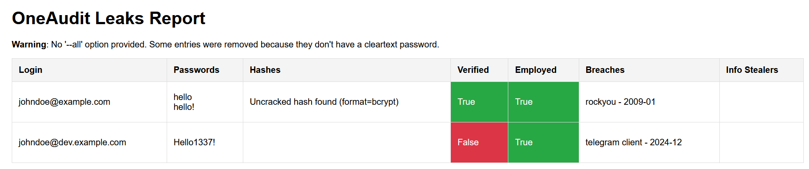

<div align="center">


[](LICENSE)
[](https://github.com/QuentinRa/oneaudit/issues)
[](https://github.com/QuentinRa/oneaudit/pulls)
[](https://github.com/QuentinRa/oneaudit)
</div>

This tool is intended for legitimate open-source intelligence (OSINT) purposes, such as research and security assessments. Users are responsible for ensuring that their use of this tool complies with all applicable laws and regulations in their jurisdiction. We strongly encourage users to respect individuals' privacy and to refrain from using this tool for any malicious activities, including harassment or unauthorized access to personal data. By using this tool, you agree to act ethically and responsibly, understanding the potential legal implications of your actions.

**Table of contents**

* [1. SocOSINT](#1-socosint)
  * [1.1 LinkedIn OSINT](#11-linkedin-osint)
* [2. Leaks](#2-leaks)
  * [2.1 Generate A List Of Targets](#21-generate-a-list-of-targets-optional)
  * [2.2 Download Leaks For Each Target](#22-download-leaks-for-each-target)
  * [2.3 Compute Stats For Each Provider](#23-compute-stats-for-each-provider)
  * [2.4 Optimize And Clean Leaks](#24-optimize-and-clean-leaks)
  * [2.5 Export Results](#25-export-results)
* [3. Passive Domain Recon](#3-passive-domain-recon)
  * [3.1 Find Subdomains From A Domain](#31-find-subdomains-from-a-domain)
  * [3.2 Find Open Ports For An IP Range](#32-find-open-ports-for-an-ip-range)
* [4. API Configuration](#4-api-configuration)
* [5. Cheatsheet](#5-cheatsheet)
* [6. Developer Notes](#6-developer-notes)

## 1. SocOSINT

### 1.1 LinkedIn OSINT

**LinkedIn Company Search**

✍️ Get name, birthdate, LinkedIn profile URL, professional and personal emails.

✅ Supported APIs: RocketReach, Apollo, Nubela

Multiple APIs have a search function which list current employees given a company domain. Each platform usually adds the employees to a profile list (`profile_list_id`) so that you can then fetch their contact information.

```powershell
oneaudit socosint linkedin scrap -d 'example.com' -o osint.json -v
oneaudit socosint linkedin scrap -d 'example.com' -o osint.json -t profile_list_id -v
```

```json5
{
  "version": 1.2,
  "entries": [
    {
      // Full name can be used to guess emails
      "full_name": "Firstname Lastname",
      // Birth Year can be used in passwords
      "birth_year": 1337,
      // Links can be used to find more information
      "links": {
        "LINKEDIN": "https://www.linkedin.com/in/john_doe"
      },
      // Emails found using Social Networks
      "emails": []
    }
  ]
}
```

**LinkedIn Employee Contact Information**

You can use this module to export a profile list, with all target employees added to it and their contact information with:

```powershell
oneaudit socosint linkedin export -s rocketreach -t 12345678 -o rrexport.json --config config.json -v
```

Unfortunately, when "looked up" by the provider, some records may be updated, and some employees in the profile list may not be in the company anymore. We can filter employees to only keep the ones we want using:

```powershell
# Only keep employees working at "LinkedIn" (you can use multiple filters).
# When using VERBOSE you can view which companies were excluded based on the filter
oneaudit socosint linkedin parse socosint linkedin parse  -f "LinkedIn" -s rocketreach -i rrexport.json -o contacts.json -v
```

```json
{
  "version": 1.0,
  "entries": [
    {
      "first_name": "John",
      "last_name": "Doe",
      "links": {
        "LINKEDIN": "https://www.linkedin.com/in/john_doe"
      },
      "emails": [
        {
          "email": "johndoe@example.com",
          "verified": false
        },
        {
          "email": "johndoe@dev.example.com",
          "verified": true
        }
      ]
    }
  ]
}
```

## 2. Leaks

#### 2.1 Generate A List Of Targets (optional)

✍️ Goal: Not all OSINT results have contact information. This module generate and guess what is missing.

✅ Supported APIs: N/A

We can compute a list of targets from OSINT results. You can use either or both `osint.json` and `contacts.json`. Having the two of them would result in more targets.

* Keep every verified email
* Only keep one email per domain (excluding verified emails)
* Generate emails for the given(s) domain(s)
* Get rid of users for which we can't generate a valid email
* **Ensure we have a least one email per OSINT result**

```powershell
# Common usage
oneaudit leaks parse -i osint.json -i contacts.json -f firstlast -d example.com -o targets.json -v
# Multiple domains
oneaudit leaks parse [...] --alias dev.example.com
```

```json
{
  "version": 1.3,
  "credentials": [
    {
      "login": "johndoe@example.com",
      "verified": true,
      "employed": true,
      "emails": [
        "johndoe@example.com",
        "johndoe@dev.example.com"
      ],
      "extra": {
        "links": {
          "LINKEDIN": "https://www.linkedin.com/in/john_doe"
        },
        "birth_year": 1337
      }
    }
  ]
}
```

#### 2.2 Download Leaks For Each Target

✍️ Goal: download leaks for each target

✅ Supported APIs: LeakCheck, HackCheck, Snusbase, etc.

If you have a list of targets, use the following command:

```powershell
# While -d is optional, using -d allow us to perform bulk queries
# Effectively reducing the number of API calls and the pricing
# As a side effect, old leaks will be fetched
oneaudit leaks download -i targets.json -o leaks.json -d example.com -v
```

If you only have one email, use the following command:

```powershell
oneaudit leaks download -t john.doe@example.com -o leaks.json -v
```

```json5
{
  "version": 1.7,
  "credentials": [
    {
      "login": "john.doe@example.com",
      // Some emails are generated, so this is handy
      "verified": true,
      // Was the email found from LinkedIn?
      "employed": true,
      // Alternate logins, it includes "login"
      "logins": [
        "john.doe",
        "johndoe@example.com",
        "johndoe@dev.example.com",
        "johndoe001"
      ],
      "censored_logins": [
        "jo*******1"
      ],
      "passwords": [
        "hello"
      ],
      // The password is probably "hello!"
      "censored_passwords": [
        "he***!"
      ],
      // Uncracked hashes (we *quickly* tried to)
      "hashes": [
        {
          "value": "8d016244527e4d86737d6a3332da6d82",
          "format": "MD5",
          "format_confidence": 40
        }
      ],
      // The logged credentials were added to the fields above
      "info_stealers": [
        {
          "computer_name": "jojo",
          "operating_system": "Windows 7 Pro x64",
          "date_compromised": "2009-01-01"
        }
      ],
      // Lowercase breach names/dates
      // "unknown" is used when the provider returned "null"
      "breaches": [
        {
          "source": "rockyou",
          "date": "2009-01"
        }
      ]
    }
  ],
  "additional": {
    "censored_data": [
      {
        "censored_username": "j******e@example.com",
        "censored_password": "**********"
      }
    ],
    "leaked_urls": [
      "https://secret.auth.example.com"
    ]
  }
}
```

#### 2.3 Compute Stats For Each Provider

✍️ Goal: compute statistics to determine how well each API performed.

✅ Supported APIs: N/A

After download leaks for each user, you can compute statistics for each API provider. You can view the percentage of entries per categories and per provider, along with the percentage of exclusive results, if applicable.

```
$ oneaudit leaks stats -i leaks.json --cache .cache
Note: Percentages marked with a star (☆) are representing the percentage of results exclusive to this API.
Note: API Provider 'unknown' (if present) includes computed passwords using cleaning rules or passwords that were added manually.

Leaks by provider
+--------------------------+-------+----------------+----------------+-----------------+-------------+-----------------+----------------+
|     field \ provider     |  aura |   proxynova    |   leakcheck    |      enzoic     | hudsonrocks |  leakcheck_pro  |    snusbase    |
+--------------------------+-------+----------------+----------------+-----------------+-------------+-----------------+----------------+
|     passwords (300)      |   x   | 46.7% (☆ 0.7%) |       x        |        x        |      x      | 94.8% (☆ 32.8%) | 31.0% (☆ 4.5%) |
| censored_passwords (450) | 96.7% |       x        |       x        |        x        |     3.3%    |        x        |       x        |
|       hashes (75)        |   x   |       x        |       x        |        x        |      x      |        x        |      100%      |
|    info_stealers (5)     |   x   |       x        |       x        |        x        |     100%    |        x        |       x        |
|     breaches (1500)      |   x   |      6.2%      | 30.5% (☆ 1.2%) | 61.7% (☆ 57.8%) |      x      |  34.9% (☆ 5.6%) |       x        |
+--------------------------+-------+----------------+----------------+-----------------+-------------+-----------------+----------------+


Breaches by count
+-----------------------+------------------------+
|       leakcheck       |         enzoic         |
+-----------------------+------------------------+
|    canva.com (25)     |      unknown (25)      |
|    twitter.com (15)   |  telegram client (15)  |
|   deezer.com (15)     |  breachforums.is (15)  |
|   stealer logs (5)    |    dropbox.com (10)    |
|    trello.com (5)     |     adobe.com (5)      |
+-----------------------+------------------------+

Passwords by length
+---------------+----------------+---------------+---------------+
|    snusbase   | leakcheck_pro  |    unknown    |   proxynova   |
+---------------+----------------+---------------+---------------+
|  Length=6 (5) | Length=8 (50)  | Length=12 (5) | Length=8 (20) |
| Length=10 (5) | Length=9 (20)  | Length=10 (5) | Length=6 (10) |
|  Length=8 (5) | Length=6 (20)  |  Length=9 (5) | Length=10 (5) |
|  Length=9 (5) | Length=10 (15) |  Length=8 (5) |  Length=7 (5) |
|  Length=7 (5) | Length=11 (15) | Length=13 (0) |  Length=9 (5) |
+---------------+----------------+---------------+---------------+
```

#### 2.4 Optimize And Clean Leaks

✍️ Goal: remove bad passwords, identify some censored passwords, etc.

✅ Supported APIs: N/A

Some passwords in the leaks may be irrelevant, such as overly short or long ones, or hashes that are mistakenly labeled as passwords by certain providers. Additionally, we may want to handle censored passwords by identifying and removing as many of them as possible using known password patterns. However, this approach carries the risk of incorrectly adding some passwords.

```
$ oneaudit leaks clean -i leaks.json -o pwned.json
$ oneaudit leaks stats -i pwned.json --cache .cache
[...]

+-------------------------+-------+----------------+----------------+-----------------+-------------+-----------------+----------------+---------+
|     field \ provider    |  aura |   proxynova    |   leakcheck    |      enzoic     | hudsonrocks |  leakcheck_pro  |    snusbase    | unknown |
+-------------------------+-------+----------------+----------------+-----------------+-------------+-----------------+----------------+---------+
|     passwords (400)     |   x   | 33.8% (☆ 0.5%) |       x        |        x        |      x      | 69.1% (☆ 23.9%) | 23.1% (☆ 3.4%) |  27.0%  |
| censored_passwords (75) | 85.1% |       x        |       x        |        x        |    14.9%    |        x        |       x        |    x    |
|       hashes (75)       |   x   |       x        |       x        |        x        |      x      |        x        |      100%      |    x    |
|    info_stealers (5)    |   x   |       x        |       x        |        x        |     100%    |        x        |       x        |    x    |
|     breaches (1500)     |   x   |      6.2%      | 30.5% (☆ 1.2%) | 61.7% (☆ 57.8%) |      x      |  34.9% (☆ 5.6%) |       x        |    x    |
+-------------------------+-------+----------------+----------------+-----------------+-------------+-----------------+----------------+---------+

[...]
```

#### 2.5 Export Results

✍️ Goal: make the best use of the results.

✅ Supported APIs: N/A

We can generate an HTML report using:

```ps
oneaudit leaks export report -i pwned.json -f html -o report.html
oneaudit leaks export report -i pwned.json -f html -o report.html --all
```



We can generate hashes for the cleartext passwords using:

```ps
oneaudit leaks export hashes -i pwned.json -f ntlm -o hashes.txt
```

We can generate wordlists using:

```ps
oneaudit leaks export wordlist -i pwned.json -o wordlists/
oneaudit leaks export wordlist -i pwned.json -o wordlists/ -c microsoft
oneaudit leaks export wordlist -i pwned.json -o wordlists/ -c microsoft -s 2
```

## 3. Passive Domain Recon

#### 3.1 Find Subdomains From A Domain

✍️ Goal: increase the number of domains found using passive subdomain enumeration. It also identify the ASN and the IP range for each domain.

✅ Supported APIs: Virus Total, crt.sh, subfinder, White Intel, etc.

There are multiple tools and APIs that can be used to find subdomains. Some of them are leveraged by this tool to provide the most comprehensive result.

For instance, if we find a certificate such as `*.wildcard.example.com` with `wildcard.example.com` not being associated to a host, multiple tools would not dig into it and miss a few subdomains.

Moreover, a few domains are hard to find due to DNS servers being hardened and websites not being associated to them -or multiple domains being associated to the same host-. We are leveraging info-stealers to find some of them.

```ps
oneaudit osint subdomains dump -d example.com -v -o domains.json
```

#### 3.2 Find Open Ports For An IP Range

✍️ Goal: Identify open ports passively for interesting IP range(s) found in [3.1](#31-find-subdomains-from-a-domain)

✅ Supported APIs: InternetDB

This module will expand CIDR ranges and investigate each IP for known open ports.

```ps
oneaudit osint ports scan 172.17.0.0/24 127.0.0.1 192.168.0.1/32
```
```json!
{
  "version": 1.0,
  "hosts": {
    "127.0.0.1": {
      "ports": [
        1337
      ],
      "details": []
    }
}
```

## 4. API Configuration

Create a JSON file called `config.json` or specify any file using `--config`. You can also define `--cache` to use an arbitrary folder for cached results.

```powershell
oneaudit [...] --config config.json --cache .cache
```

The expected format **without any comments** is:

```json5
{
  // These APIs are free, just leave the key empty
  "aura": "",
  "hudsonrocks": "",
  "leakcheck": "",
  "nth": "",
  "proxynova": "",
  "spycloud": "",
  "haveibeenpwned": "",
  "subfinder": "subfinder",
  "crtsh": "",
  "certspotter": "",
  "webarchive": "",
  "ipwhois": "",
  "internetdb": "",
  // These APIs are paid, an API key is required
  "enzoic": "your_api_key:your_api_secret",
  "hackcheck": "your_api_key",
  "leakcheck_pro": "your_api_key",
  "snusbase": "your_api_key",
  "hashmob": "your_api_key",
  "rocketreach": "your_api_key",
  "rocketreach_session": "your_session_key",
  "nubela": "your_api_key",
  "virustotal": "your_api_key",
  // This API is disabled (leading underscore)
  "_whiteintel": "your_api_key",
}
```

The followed APIs are used by the plugin:

| API Identifier                                     | Pricing    | Usage                                          |
|----------------------------------------------------|------------|------------------------------------------------|
| [rocketreach](https://rocketreach.co/)             | `FREEMIUM` | Access LinkedIn API. Lookup for emails/phones. |
| [nubela](https://rocketreach.co/)                  | `PAID`     | Access LinkedIn API. Lookup for emails/phones. |
| [apollo](https://docs.apollo.io/docs/api-overview) | `PAID`     | Access LinkedIn API. Lookup for emails/phones. |
| [hudsonrocks](https://www.hudsonrock.com/cavalier) | `FREE`     | InfoStealer API (censored).                    |
| [whiteintel](https://whiteintel.io/)               | `FREEMIUM` | InfoStealer API (censored).                    |
| [leakcheck](https://leakcheck.io/)                 | `FREE`     | Data breaches API.                             |
| [spycloud](https://spycloud.com/)                  | `FREE`     | Data breaches API.                             |
| [haveibeenpwned](https://haveibeenpwned.com/)      | `FREE`     | Data breaches API.                             |
| [enzoic](https://www.enzoic.com/)                  | `FREEMIUM` | Data breaches API.                             |
| [proxynova](https://www.proxynova.com/tools/comb)  | `FREE`     | Leaked Credentials API.                        |
| [leakcheck_pro](https://leakcheck.io/)             | `PAID`     | Leaked Credentials API.                        |
| [snusbase](https://docs.snusbase.com/)             | `PAID`     | Leaked Credentials API.                        |
| [hackcheck](https://app.hackcheck.io)            | `PAID`     | Leaked Credentials API.                        |
| [aura](https://scan.aura.com/)                     | `FREE`     | Leaked Credentials API (censored).             |
| [nth](https://github.com/HashPals/Name-That-Hash)  | `FREE`     | Hash Identifier.                               |
| [hashmob](https://hashmob.net/)                    | `FREEMIUM` | Hash Rainbow tables.                           |

Candidates:

* [hashes.com](https://hashes.com/en/docs): hash identifier (FREE) or Rainbow table (PAID)
* [DeHashed](https://www.dehashed.com/): Leaked Credentials. Require Platform and API subscriptions.
* [idstrong](https://www.idstrong.com/): Data breaches, no API
* [AmIBreached](https://amibreached.com/): Data breaches, no API
* [KeeperSecurity](https://www.keepersecurity.com): Data breaches, no API


## 5. Cheatsheet

Configuration

```
domain=example.com
profile_list_opt=-t 12345678
config_opt=--config ./config.json
cache_opt=--cache .cache
filters=-f "Microsoft"
company_name=-c microsoft
per_wordlist=2
mail_format=first.last
out=./output/$domain/
```

SocOSINT

```powershell
$ oneaudit socosint linkedin scrap -d $domain -o $out/osint.json $config_opt $profile_list_opt -v
$ oneaudit socosint linkedin export -s rocketreach $profile_list_opt -o $out/rrexport.json $config_opt -v
$ oneaudit socosint linkedin parse -s rocketreach $filters -i $out/rrexport.json -o $out/contacts.json -v
```

Leaks

```powershell
$ oneaudit leaks parse -i $out/contacts.json -i $out/osint.json -f $mail_format -d $domain -o $out/targets.json
$ oneaudit leaks download -i $out/targets.json -o $out/leaks.json $config_opt $cache_opt -vv -r -d $domain
$ oneaudit leaks clean -i  $out/leaks.json -o  $out/pwned.json
$ oneaudit leaks export report -i $out/pwned.json -f html -o $out/report.html
$ oneaudit leaks export wordlist -i $out/pwned.json -o $out/wordlists/ $company_name -s $per_wordlist
$ oneaudit leaks stats -i  $out/pwned.json $cache_opt
```

## 6. Developer Notes

WIP

* Test only one email per domain with verifying emails
* Add proxy support
* email verification documentation
* subdomains
  * add option to only keep some range(s) of IPs
  * leakix
  * cache webarchive parsed output, as it may takes time
* Fix issues with rocketreach randomness in search
* Scan leaks from a list of emails (e.g. nxc output, etc.)

#### Leak And Breaches Dates

We won't implement a logic to filter leaks by date (such as to keep recent ones).

* Multiple providers are not returning breach dates
* Multiple providers are returning invalid dates
* Multiple providers are not sorting passwords per breach
* Breach Compilations do not include breach data